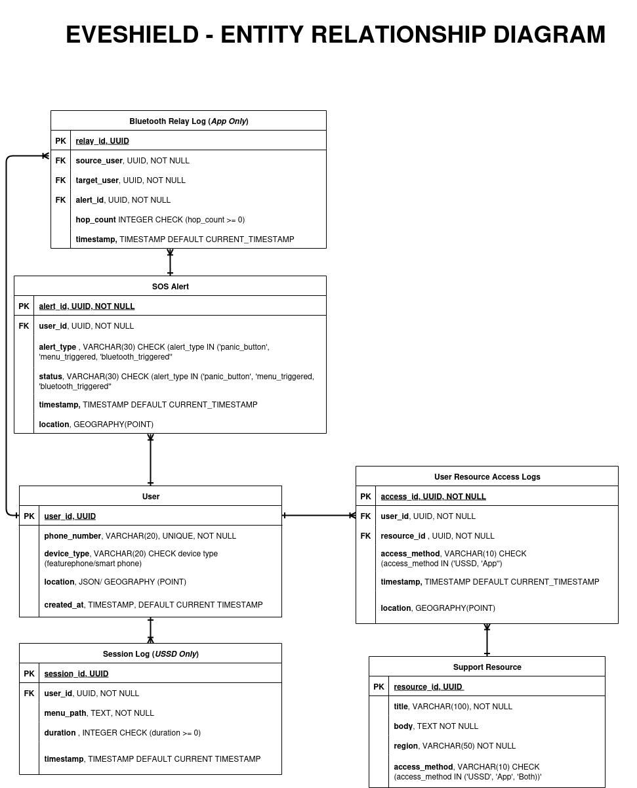

# EveShield MVP – Database Schema Documentation

This document explains the structure, relationships, and rationale behind each database entity used in the EveShield MVP, guided by the application's business logic. The corresponding SQL schema is maintained separately.

---

## 👥 Users

Represents individuals interacting with the system, either through USSD or the Android app.

- **Primary Key:** `user_id` (UUID)
- **Unique Field:** `phone_number`
- **Fields:**
  - `phone_number`: mobile number (must be stored securely)
  - `device_type`: defines user entry mode (`feature_phone`, `smartphone`)
  - `location`: last known coordinates (nullable)
  - `created_at`: registration or first interaction timestamp
- **Usage:** All emergency interactions are tied to a user. Used in relational joins for alerts, sessions, and relays.

---

## 🚨 SOS Alerts

Captures emergency signals triggered by the user.

- **Primary Key:** `alert_id` (UUID)
- **Foreign Key:** `user_id` references `users`
- **Fields:**
  - `alert_type`: method used to trigger alert (`panic_button`, `menu_triggered`, `bluetooth_triggered`)
  - `status`: processing state of the alert (`sent`, `pending`, `offline_stored`, `retried`)
  - `timestamp`: when the alert was generated
  - `location`: coordinates at the time of alert (nullable)
- **Relationships:**
  - One `user` → Many `sos_alerts`
  - One `sos_alert` → Many `bluetooth_relay_logs`

---

## 🆘 Support Resources

Static or semi-static content served through the USSD interface or app.

- **Primary Key:** `resource_id` (UUID)
- **Fields:**
  - `title`, `body`: resource information
  - `region`: defines geographical relevance
  - `access_method`: visibility channel (`USSD`, `App`, `Both`)
- **Usage:** Delivered contextually based on region and user interaction mode.

---

## 🔁 Bluetooth Relay Logs (App Only)

Logs alert packets that were transmitted across users via Bluetooth mesh networking.

- **Primary Key:** `relay_id` (UUID)
- **Foreign Keys:**
  - `alert_id` references `sos_alerts`
  - `source_user` and `target_user` reference `users`
- **Fields:**
  - `hop_count`: how many times the alert was relayed
  - `timestamp`: when the relay occurred
- **Usage:** For forensic tracking, analytics, and debugging offline-first behavior.

---

## 📞 USSD Session Logs (USSD Only)

Tracks all USSD interactions for session analysis and behavioral insights.

- **Primary Key:** `session_id` (UUID)
- **Foreign Key:** `user_id` references `users`
- **Fields:**
  - `menu_path`: sequence of user actions
  - `duration`: time spent in seconds
  - `timestamp`: session time
- **Usage:** Useful for UX research, menu optimization, and incident tracing.

---

## 🔗 Entity Relationships

- **User → SOS Alert:** One-to-many
- **User → Session Log:** One-to-many
- **User → Bluetooth Relay Log:** One-to-many (as sender or receiver)
- **SOS Alert → Bluetooth Relay Log:** One-to-many
- **Support Resource ↔ Users:** Many-to-many (via access patterns, not direct linkage)

---

### Database Schema

- This section provides an illustration of the database schema:

> 

## 🔐 Notes

- Use strong hashing/encryption for sensitive fields like `phone_number`.
- Separate schemas can be used for Android (Room) and backend (PostgreSQL/PostGIS).
- Consider sharding or region-based partitioning post-MVP for scale.
- Indexes on foreign keys and frequently queried fields (like `phone_number`, `region`) are crucial for performance.

---

This schema is designed to be modular, secure, and efficient for an offline-capable emergency response system. It aligns with the MVP goal of delivering timely, reliable alerts across diverse mobile environments.
